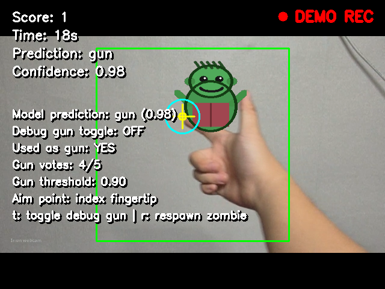
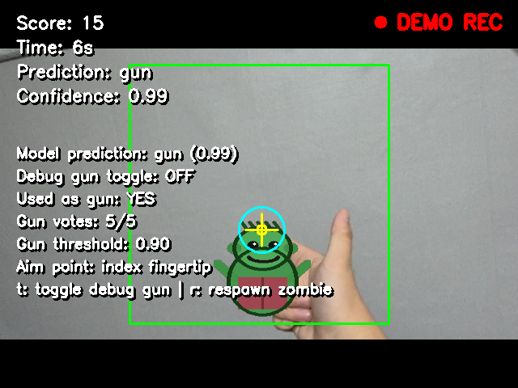

# AR Zombie Shooting Game with Hand-Gun Gesture Recognition

## 1. 프로젝트 개요

이 프로젝트는 컴퓨터 비전 과목 텀프로젝트로 제작한 실시간 AR 좀비 슈팅 게임이다.

웹캠으로 입력되는 실시간 영상에서 사용자의 손 총 모양을 인식하고, 카메라 화면 위에 좀비 이미지를 AR처럼 표시한다. 사용자가 손 총 모양을 유지한 상태에서 조준점이 좀비와 겹치면 좀비가 맞은 것으로 처리되고 점수가 증가한다.

현재 버전은 1차 MVP 완성을 목표로 한다. 처음부터 MediaPipe Hands나 복잡한 손 방향 추정을 넣기보다는, OpenCV 웹캠 처리, 중앙 ROI 기반 CNN 분류, 간단한 손끝 추정, 그리고 게임 로직이 실제로 동작하는 것을 우선으로 구현했다.

## 2. 주요 기능

- OpenCV를 이용한 실시간 웹캠 입력
- 중앙 ROI 기반 손 제스처 이미지 수집 및 분류
- PyTorch 기반 `gun / non_gun` 2-class CNN 모델
- 실시간 모델 추론
- 웹캠 화면 위에 좀비 이미지 표시
- `assets/zombie.png`가 없을 경우 사각형 좀비로 대체 표시
- OpenCV contour 기반 검지 손끝 위치 추정
- 손끝 조준점과 좀비 bounding box를 이용한 hit detection
- 점수 증가 및 60초 제한 시간
- 모델이 없어도 게임 로직을 확인할 수 있는 debug mode
- `game.py`에서 바로 실행 가능한 1분 자동 데이터 수집 모드
- Windows 환경 기준 `py` 명령어 실행 지원

## 3. 시스템 파이프라인

```text
웹캠 프레임 입력
    |
    v
중앙 ROI crop
    |
    v
전처리
BGR -> RGB, 224x224 resize, tensor 변환, ImageNet normalize
    |
    v
CNN 모델 추론
gun / non_gun 예측
    |
    v
OpenCV 기반 손끝 추정
손 contour를 찾고 검지 손끝 후보 위치 계산
    |
    v
게임 로직
gun 상태 + 손끝 조준점이 좀비 박스 안에 있으면 hit
    |
    v
화면 출력
좀비, ROI, 조준점, 점수, 남은 시간, 예측 결과, confidence 표시
```

## 4. 데이터셋 구조

데이터셋은 `torchvision.datasets.ImageFolder`에서 바로 읽을 수 있도록 클래스 이름별 폴더 구조로 구성했다.

```text
dataset/
+-- gun/
|   +-- gun_0001.jpg
|   +-- gun_0002.jpg
|   +-- ...
+-- non_gun/
    +-- non_gun_0001.jpg
    +-- non_gun_0002.jpg
    +-- ...
```

데이터 수집 방법은 두 가지가 있다.

| 방법 | 실행 방법 | 설명 |
|---|---|---|
| 수동 수집 | `py collect_data.py` | `g` 키로 `gun`, `n` 키로 `non_gun` 이미지를 저장한다. |
| 자동 수집 | `py game.py` 실행 후 `d` 선택 | 30초는 `gun`, 30초는 `non_gun` 데이터를 자동 저장한다. |

자동 데이터 수집 모드에서는 가능한 같은 배경을 유지하는 것이 중요하다. 앞 30초는 같은 배경에서 손 총 모양만 넣고, 뒤 30초는 같은 배경에서 손만 제거한다. 이렇게 해야 모델이 배경이 아니라 손 총 모양 자체를 더 잘 학습할 수 있다.

개인정보 보호를 위해 실제 학습 이미지와 `dataset_archive/` 폴더는 GitHub에 업로드하지 않는다. 저장소에는 폴더 구조만 유지하고, 필요한 경우 `py collect_data.py` 또는 `py game.py`의 `d` 옵션으로 데이터를 다시 수집한다.

## 5. 모델 설명

기본 모델은 `model.py`의 `SimpleHandGunCNN`이다.

```text
입력 shape:  batch x 3 x 224 x 224
출력 shape:  batch x 2
클래스:      gun, non_gun
```

모델 구조는 초보자가 이해하기 쉬운 간단한 CNN으로 구성했다.

- `Conv2d`: ROI 이미지에서 시각적 특징을 추출한다.
- `ReLU`: 비선형성을 추가한다.
- `MaxPool2d`: feature map 크기를 줄이고 연산량을 줄인다.
- `AdaptiveAvgPool2d`: flatten 크기를 직접 계산하지 않아도 되게 한다.
- `Linear`: 최종적으로 `gun` 또는 `non_gun`으로 분류한다.

학습된 모델은 다음 경로에 저장된다.

```text
models/hand_gun_model.pth
```

학습된 모델 파일도 개인 데이터에서 만들어진 checkpoint이므로 기본적으로 GitHub 업로드 대상에서 제외한다. 모델이 필요한 경우 데이터 수집 후 `py train.py`를 실행해서 다시 생성할 수 있다.

추후 개선을 위해 `MobileNetV2` transfer learning을 사용할 수 있는 함수도 `model.py`에 포함했지만, 현재 MVP 학습 코드는 기본적으로 `SimpleHandGunCNN`을 사용한다.

## 6. 게임 규칙

- 게임 시간은 60초이다.
- 좀비는 ROI 영역 안에서 랜덤 위치에 생성된다.
- 사용자는 손 총 모양을 중앙 ROI 안에 넣는다.
- CNN 모델은 ROI 이미지를 `gun` 또는 `non_gun`으로 예측한다.
- OpenCV 기반 손끝 추정으로 검지 손끝 근처에 조준점을 표시한다.
- `gun` 상태이고 조준점이 좀비 bounding box와 겹치면 좀비가 맞은 것으로 처리한다.
- 좀비가 맞으면 점수가 1 증가하고, 좀비는 새로운 위치에 다시 생성된다.
- 시간이 끝나거나 사용자가 종료하면 최종 점수가 콘솔에 출력된다.

게임 중 조작키는 다음과 같다.

| 키 | 동작 |
|---|---|
| `t` | debug gun 상태를 True/False로 토글 |
| `r` | 좀비 위치 랜덤 재생성 |
| `q` 또는 `ESC` | 게임 종료 |

## 7. 프로젝트 구조

```text
project/
+-- README.md
+-- requirements.txt
+-- collect_data.py
+-- model.py
+-- train.py
+-- utils.py
+-- game.py
+-- dataset/
|   +-- gun/
|   +-- non_gun/
+-- models/
|   +-- hand_gun_model.pth
+-- assets/
|   +-- zombie.png
+-- screenshots/
```

주요 파일 설명은 다음과 같다.

| 파일 | 역할 |
|---|---|
| `collect_data.py` | 웹캠으로 `gun`, `non_gun` 데이터를 수동 수집한다. |
| `model.py` | CNN 모델과 선택적 MobileNetV2 모델 함수를 정의한다. |
| `train.py` | `ImageFolder`로 데이터셋을 읽고 모델을 학습한 뒤 best checkpoint를 저장한다. |
| `utils.py` | 이미지 overlay, hit detection, crosshair, status text, 모델 입력 전처리 함수를 포함한다. |
| `game.py` | 메인 게임 실행과 1분 자동 데이터 수집 모드를 담당한다. |

이 프로젝트는 `main.py`를 만들지 않는다. 실행 파일은 `collect_data.py`, `train.py`, `game.py` 세 개를 기준으로 한다.

## 8. 설치 방법

개발 환경은 Windows + Python 기준이다.

필요한 라이브러리는 다음 명령어로 설치한다.

```powershell
py -m pip install -r requirements.txt
```

`requirements.txt`에 포함된 라이브러리는 다음과 같다.

```text
opencv-python
numpy
torch
torchvision
```

만약 기본 `py` 명령어가 PyTorch가 설치되지 않은 Python 버전을 사용한다면, 특정 Python 버전을 지정해서 실행할 수 있다.

```powershell
py -3.12 -m pip install -r requirements.txt
```

## 9. 실행 방법

### 1. 데이터 수동 수집

```powershell
py collect_data.py
```

수동 수집 조작키는 다음과 같다.

| 키 | 동작 |
|---|---|
| `g` | 현재 ROI 이미지를 `dataset/gun`에 저장 |
| `n` | 현재 ROI 이미지를 `dataset/non_gun`에 저장 |
| `q` 또는 `ESC` | 데이터 수집 종료 |

### 2. 모델 학습

```powershell
py train.py
```

`train.py`는 다음 기능을 수행한다.

- `torchvision.datasets.ImageFolder`로 이미지 데이터셋을 읽는다.
- train/validation 데이터를 8:2 비율로 나눈다.
- loss는 `CrossEntropyLoss`를 사용한다.
- optimizer는 `Adam`을 사용한다.
- epoch마다 train loss, train accuracy, validation accuracy를 출력한다.
- validation accuracy가 가장 높은 모델을 `models/hand_gun_model.pth`로 저장한다.
- `class_to_idx`를 출력해서 클래스 index 매핑을 확인할 수 있게 한다.

### 3. 게임 실행

```powershell
py game.py
```

`game.py`를 실행하면 다음 메뉴가 나온다.

```text
1. Play hand-gun gesture zombie shooting
d. Collect 1-minute reliable data
q. Quit
```

`1`을 선택하면 손 총 제스처 좀비 슈팅 게임을 실행한다.

`d`를 선택하면 1분 자동 데이터 수집 모드를 실행한다.

- 앞 30초: ROI 안에 손 총 모양을 넣고 `gun` 데이터를 수집한다.
- 뒤 30초: 손을 빼고 같은 배경을 유지해서 `non_gun` 데이터를 수집한다.
- 새 데이터를 수집한 뒤에는 `py train.py`로 모델을 다시 학습한다.

모델 파일이 없으면 먼저 다음 명령어로 학습하라는 안내가 출력된다.

```powershell
py train.py
```

모델 파일이 없거나 모델 정확도가 낮아도 debug mode를 이용하면 게임 로직 자체는 테스트할 수 있다.

## 10. 디버그 모드

디버그 모드는 모델이 아직 충분히 학습되지 않았을 때도 게임 로직을 확인하기 위해 추가했다.

| 키 | 동작 |
|---|---|
| `t` | gun 상태를 강제로 True/False 토글 |
| `r` | 좀비 위치 랜덤 재생성 |
| `q` 또는 `ESC` | 게임 종료 |

debug gun 상태가 True이면 CNN 예측 결과와 상관없이 사용자를 `gun` 상태로 처리한다. 이를 통해 모델 정확도가 낮은 상황에서도 좀비 생성, 조준점 표시, hit detection, score 증가, timer 동작을 확인할 수 있다.

게임 화면에는 모델 예측 결과와 debug gun 상태가 따로 표시되므로, 모델이 맞춘 것인지 debug mode로 강제 처리된 것인지 구분할 수 있다.

## 11. 데모 스크린샷 / 데모 영상

게임 실행 화면은 `screenshots/` 폴더에 추가할 수 있다.

```text
screenshots/demo_1.png
screenshots/demo_2.png
screenshots/demo_gameplay.mp4
```

README에 이미지를 넣을 때는 다음 형식을 사용할 수 있다.

```markdown


```

데모 영상은 아래 파일로 확인할 수 있다.

[데모 게임 플레이 영상](screenshots/demo_gameplay.mp4)

## 12. 결과

현재 MVP 버전에서는 데이터 수집, 모델 학습, 실시간 추론, 게임 로직을 하나의 흐름으로 연결하는 데 성공했다.

- CNN 기반 `gun / non_gun` 분류 모델을 구현하고 학습했다.
- 웹캠 실시간 입력과 PyTorch 모델 추론을 게임 루프에 연결했다.
- 화면에 점수, 남은 시간, 예측 결과, confidence, ROI, 좀비, 조준점을 표시한다.
- 손 총 인식, 손끝 기반 조준점, 좀비 hit 판정, 좀비 재생성, 점수 증가가 동작한다.
- 데이터 품질이 모델 성능에 큰 영향을 주는 것을 확인했고, 같은 배경에서 `gun`과 `non_gun` 데이터를 수집하는 자동 수집 모드를 추가했다.

현재 버전은 완벽한 손 추적 시스템이라기보다는, 컴퓨터 비전 기술을 활용해 실제로 동작하는 게임 MVP를 완성하는 것에 초점을 맞췄다.

## 13. 어려웠던 점과 해결 방법

### 1. 손 총 모양이 처음에는 잘 인식되지 않는 문제

초기에는 사용자가 손 총 모양을 만들어도 모델이 `non_gun`으로 예측하는 경우가 많았다.

해결 방법:

`gun`과 `non_gun` 데이터를 추가로 수집하고 모델을 다시 학습했다. 실제 게임에서 사용하는 환경과 비슷한 조건으로 데이터를 모으도록 수집 과정을 개선했다.

### 2. 배경이나 물체가 `gun`으로 잘못 인식되는 문제

책상, 휴지곽, 배경 일부가 `gun`으로 잘못 인식되는 경우가 있었다.

해결 방법:

같은 배경에서 손이 있는 상태와 손이 없는 상태를 나누어 수집하도록 자동 데이터 수집 기능을 추가했다. 앞 30초는 손 총 모양, 뒤 30초는 같은 배경에서 손을 제거한 이미지를 수집한다. 이렇게 하면 모델이 배경보다는 손 모양 차이에 더 집중해서 학습할 수 있다.

### 3. 중앙 고정 조준점만으로는 손으로 조준하는 느낌이 약한 문제

초기 MVP에서는 화면 중앙 crosshair를 기준으로 조준했지만, 사용자의 손 움직임과 직접적으로 연결되는 느낌이 부족했다.

해결 방법:

OpenCV contour 기반으로 검지 손끝 위치를 추정하고, 해당 위치 근처에 조준점을 표시하도록 개선했다. 덕분에 손 총 모양으로 좀비를 겨누는 느낌이 더 자연스러워졌다.

### 4. 첫 MVP에서 기능이 과도하게 복잡해지는 문제

MediaPipe Hands, 손 방향 추정, 손가락 landmark 추적을 처음부터 모두 넣으면 프로젝트 복잡도가 크게 증가한다.

해결 방법:

1차 MVP에서는 OpenCV + CNN + 간단한 게임 로직에 집중했다. 고급 손 추적 기능은 추후 개선 사항으로 남겼다.

## 14. 향후 개선 사항

- 다양한 조명, 배경, 거리, 손 모양에서 데이터를 더 수집한다.
- MobileNetV2 같은 transfer learning 모델을 적용한다.
- MediaPipe Hands를 사용해 검지 손끝을 더 정확하게 추적한다.
- 손 방향 추정을 추가해 더 자연스러운 조준 방식을 구현한다.
- 좀비 애니메이션, 사운드, hit effect를 추가한다.
- 좀비 크기, 생성 속도, hit cooldown 등으로 난이도를 조절한다.
- 시작 화면과 게임 종료 화면 등 UI를 개선한다.
- confusion matrix, precision, recall, F1-score 같은 평가 지표를 추가한다.
- 최고 점수 또는 게임 로그를 저장한다.

## 15. 참고 자료

- [OpenCV 공식 문서](https://docs.opencv.org/4.x/)
- [PyTorch 공식 문서](https://docs.pytorch.org/docs/stable/index.html)
- [torchvision 공식 문서](https://docs.pytorch.org/vision/stable/index.html)
- 서울과학기술대학교 컴퓨터 비전 수업 자료
- 외부 코드 또는 이미지 asset을 사용한 경우:
- 외부 코드를 참고했다면 URL과 사용한 부분을 명시한다.
- `assets/zombie.png`를 외부에서 다운로드했다면 URL, license, 사용 용도를 명시한다.

## 16. 라이선스

이 프로젝트는 컴퓨터 비전 과목 텀프로젝트 제출을 위해 제작했다.

현재 별도의 오픈소스 라이선스는 지정하지 않았다. GitHub에 공개 저장소로 제출할 경우 MIT License 같은 적절한 라이선스를 추가할 수 있다. 외부 이미지 asset이나 외부 코드를 사용했다면 해당 라이선스도 확인해서 참고 자료에 함께 작성해야 한다.
